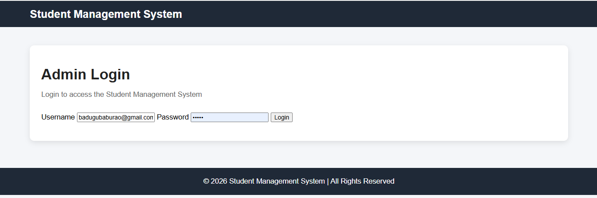
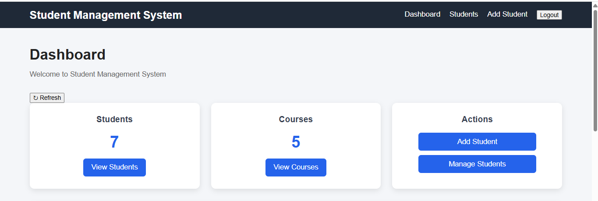
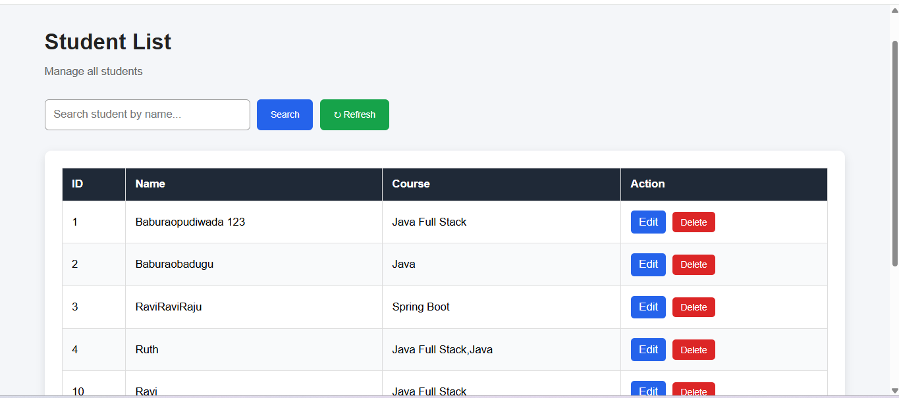
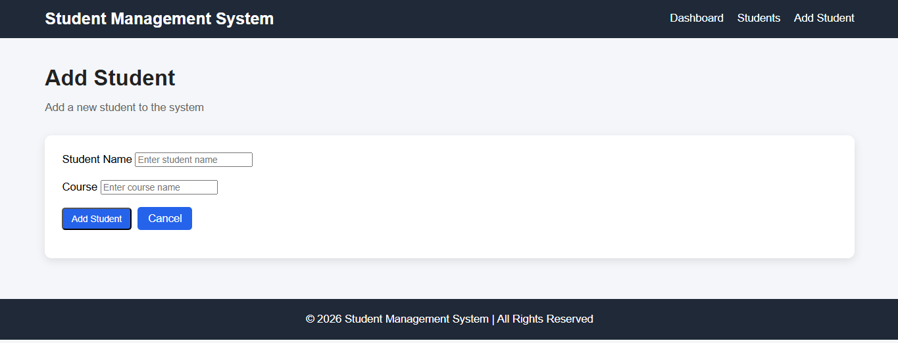
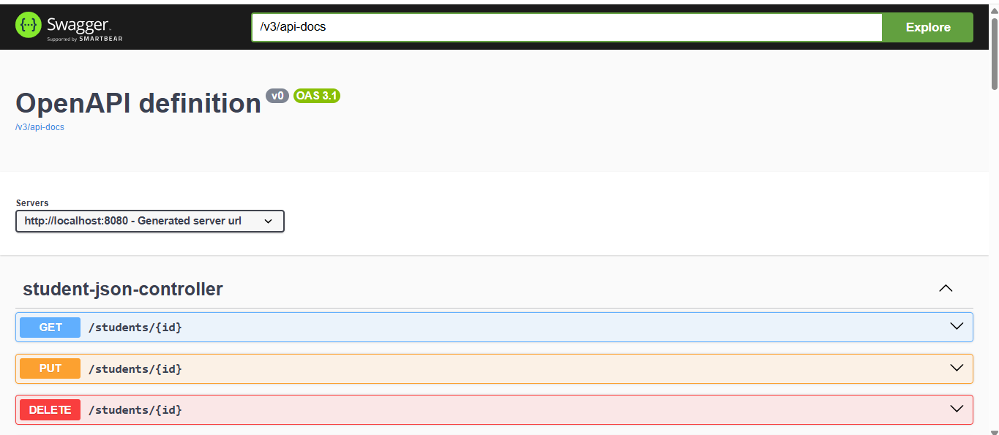

# 🎓 Student Management System

A full-stack Student Management System developed using Java, Spring Boot, MySQL, HTML, CSS and JavaScript.

## 🚀 Features

- 🔐 Admin Login
- 📊 Dashboard
- ➕ Add Student
- 👨‍🎓 View Students
- ✏️ Edit Student
- 🗑️ Delete Student
- 🔍 Search Students
- 🎯 Filter Students
- 📄 Pagination
- ↕️ Sorting
- 🔗 REST APIs
- 📚 Swagger API Documentation
- 📱 Responsive UI
- 🔄 Dashboard Refresh
- 🕒 Recent Students
- 🔧 Git & GitHub Version Control

## 🛠️ Technologies Used

### Backend
- Java
- Spring Boot
- Spring Data JPA
- REST API
- Maven

### Database
- MySQL

### Frontend
- HTML5
- CSS3
- JavaScript

### API Documentation
- Swagger / OpenAPI

### Tools
- Eclipse
- VS Code
- Git
- GitHub

## 📂 Project Structure

```text
FirstSpringBootProject
│
├── src
│   └── main
│       ├── java
│       │   └── com
│       │       └── ...
│       │
│       └── resources
│           ├── static
│           │   ├── css
│           │   │   └── style.css
│           │   ├── index.html
│           │   ├── login.html
│           │   ├── students.html
│           │   ├── add-student.html
│           │   └── ...
│           │
│           └── application.properties
│
├── screenshots
│   ├── login.png
│   ├── dashboard.png
│   ├── student.png
│   ├── add-student.png
│   └── swagger.png
│
├── pom.xml
├── README.md
└── .gitignore

## 🔗 REST API Endpoints

| Method | Endpoint | Description |
|---|---|---|
| GET | `/students` | Get all students |
| GET | `/students/{id}` | Get student by ID |
| POST | `/students` | Add new student |
| PUT | `/students/{id}` | Update student |
| DELETE | `/students/{id}` | Delete student |
| GET | `/students/search` | Search students |
| GET | `/students/page` | Pagination |
| GET | `/students/filter` | Filter students |
| GET | `/students/filter-advanced` | Advanced filtering |
| GET | `/students/course` | Search students by course |
```
## 📸 Screenshots

### Login Page



### Dashboard



### Student List



### Add Student



### Swagger API



## ▶️ How to Run

### Step 1: Clone the Repository

```bash
git clone https://github.com/Babu123455536/FirstSpringBootProject.git